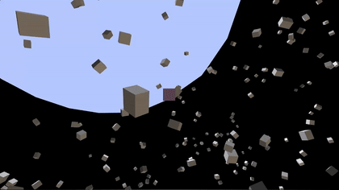

# 3rd person Slicing machenic testing game

A machanic testing game built using [raylib](https://www.raylib.com/) and [entt](https://github.com/skypjack/entt). Slicing enemy and physics!!
goal is to create a 3d Game but I can slice enemy like fruit ninja with my mouse.

## 🎮 Features

- [x] 3D environment
- [x] ECS architecture using `entt`
- [x] physics!!!
- [x] BVH for collision optimization
- [x] enemy Body generation using flood fill
- [ ] detachable enemy body
- [ ] detachable enemy body

## 🕹️ Controls

| Action         | Key |
|----------------|-----|
| Move           | `W`, `A`, `S`, `D` |
| Accelerate          | `Space` |
| Decelerate     | `Shift` |
| close     | `ESC` |

## 📸 Snapshots

### Physics



### Enemy Body Regen


## Getting Started

### Prerequisites

- C++ compiler (supporting C++17)
- linux or equivalent environment (macos | windows wsl)

### Installation
```bash
git clone
```

### Build and run
```bash
make
./a.out
```
By default `make` is `make run`
